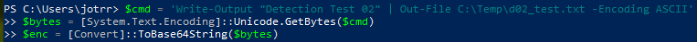
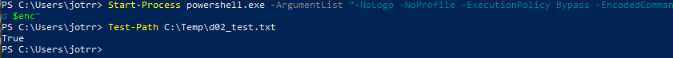
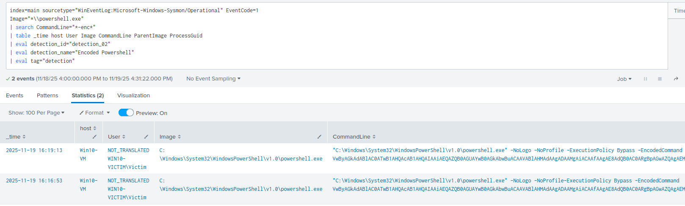

# Detection 02 - Encoded PowerShell Command Execution

### Purpose
Detects use of **PowerShell with Base64 encoded commands** (`-EncodedCommand`). This is a common evasion technique used by attackers to hide malicous payloads

---

### ATT&CK Mapping

T1059.001 - Command and scripting interpreter: Powershell 

T1027 - Obfuscated Files or Information

--- 

### Data Source

| Source | Details |
|--------|---------|
| Sysmon | EventCode 1 - Process Creation |

---

### Test Case

Execute an encoded command via powershell and verify the event is detected in Splunk

Expected Result: Encoded command executes -> Text file dropped into C:\Temp -> Event logged in Splunk

1. Create a benign encoded command that creates a txt file with some plaintext.

```powershell
$cmd = 'Write-Output "Detection Test 02" | Out-File C:\Temp\d02_test.txt -Encoding ASCII'
$bytes = [System.Text.Encoding]::Unicode.GetBytes($cmd)
$enc = [Convert]::ToBase64String($bytes)
```



2. Execute the command via powershell

```powershell
Start-Process powershell.exe -ArgumentList "-NoLogo -NoProfile -ExecutionPolicy Bypass -EncodedCommand $enc"
```

3. Verify the file was dropped in C:\Temp

```powershell
Test-Path C:\Temp\d02_test.txt
```



4. Run Production SPL detection query in Splunk



---

### SPL Detection Queries

**Production Rule**
```spl
index=main sourcetype="WinEventLog:Microsoft-Windows-Sysmon/Operational" EventCode=1 
Image="*\\powershell.exe"
| search CommandLine="*-enc*"
| table _time host User Image CommandLine ParentImage ProcessGuid
| eval detection_id="detection_02"
| eval detection_name="Encoded Powershell"
| eval tag="detection"
```
---

### Notes
- This event is rare in normal environments so detection of this is a good signal of suspicous activity
- PowerShell logging does not capture the full command by default - Sysmon is required
- Detection works even if ExecutionPolicy is modified or bypassed

---

### False Positive Cases

- Admin scripts
- Automation tools
- PenTesting tools

### Mitigations and Tuning

- Whitelist trusted admins
- Whitelist known automation scripts/hosts
- Add rarity checks (If a user/host never runs encoded commands -> Treat as highly suspicious)

---

### Quick Playbook

On Detection:
1. Check User field and compare them to whitelisted Users
2. Use rarity check to determine if event is abnormal for the user/host
3. Decode the command to verify intent
4. If the command was malicious -> Isolate host and escalate
5. Check for persistence (Other executed commands, dropped files, installs, registry changes, outbound network connections)

### Status

- ✅ Test validated in Splunk
- ✅ Test evidence captured
- ✅ Production ready


