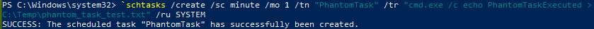
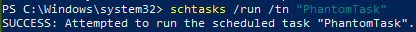
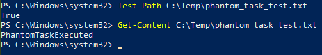
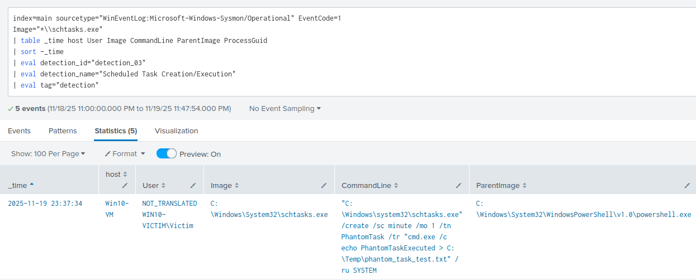
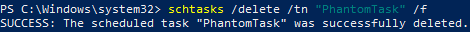

# Detection 03 - Suspicious Scheduled Task Creation/Execution

### Purpose

Detect the creation or execution of scheduled tasks (schtasks.exe) for persistence.

Attackers that gain elevated access will commonly create scheduled tasks to execute scripts at specific times to evade detetion or maintain persistence across reboots.

---

### ATT&CK Mapping

T1053.005 - Scheduled Task/Job: Scheduled Task

---

### Data Sources

| Source | Details |
|--------|---------|
| Sysmon | EventCode 1 - Process Create |

---

### Test Case

Create a scheduled task that on execution, drops a text file into the Temp directory.

Expected Result: Task successfully creates a file and the event is logged in Splunk

1. Create a harmless scheduled task that echoes a file every minute

In Elevated powershell:
```powershell

`schtasks /create /sc minute /mo 1 /tn "PhantomTask" /tr "cmd.exe /c echo PhantomTaskExecuted > C:\Temp\phantom_task_test.txt" /ru SYSTEM
```



2. Wait a minute or optionally run it immediately
```powershell
schtasks /run /tn "Detection_03_TestTask"
```



3. Check the file was created
```powershell
Test-Path C:\Temp\phantom_task.txt
Get-Content C:\Temp\phantom_task.txt
```



4. Use the production spl rule to verify the event logged into Splunk



5. Delete the task (cleanup)
```powershell
schtasks /delete /tn "Detection_03_TestTask" /f
```



### SPL Detection Queries

**Production Rule**
```spl
index=main sourcetype="WinEventLog:Microsoft-Windows-Sysmon/Operational" EventCode=1
Image="*\\schtasks.exe"
| table _time host User Image CommandLine ParentImage ProcessGuid
| sort -_time
| eval detection_id="detection_03"
| eval detection_name="Scheduled Task Creation/Execution"
| eval tag="detection"
```

### Notes
- This event should only ever occur under a system account or a dedicated service account by an admin user
- This rule only captures sysmon events, Windows Security can also detect this event under the ID 4698 if security audit is enabled

### False Positive Cases

- Admin's scheduling legitimate tasks
- Backup solutions
- Patching tools
- Monitored maintenance

### Mitigations and Tuning

- Whitelist known automation users/hosts
- Correlate with asset inventory (i.e Administrative hosts vs user endpoints)
- Suppress tasks created by approved groups using `ParentImage` and `User` fields
- Add rarity checks (Treat hosts/users who never create tasks aa higher priority)

# Quick Playbook 

On Detection:

1. Look up the `User` and `ParentImage`. If the user is non-admin and the ParentImage is a Living of the Land (LotL) Binary such as explorer.exe or powershell -> Escalate.
2. Pull the created task's command from the `CommandLine` field
3. If the task runs a suspicious binary or attempts to contact an external network -> Isolate the host
4. Search for related persistence (i.e Other tasks, installs, registry changes, WMI changes, dropped files)

### Status

- ✅ Test case validated
- ✅ Test Evidence captured
- ✅ Production ready
 
 
