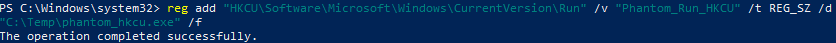
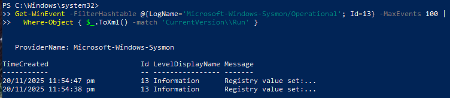
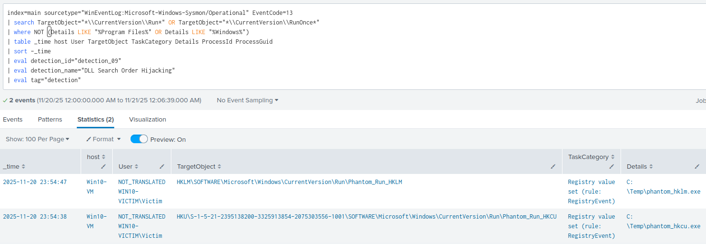

# Detection 04 - Registry Run Key Persistence

### Purpose
Detect the creation or modification of Windows registry run keys for the use of persistence. This is a common technique used by threat actors to maintain presence in a system.

---

### ATT&CK Mappings
T1547.001 - Boot or Logon Autostart Execution: Registry Run Keys and Startup Folder

---

### Data Sources

| Source | Details |
|--------|---------|
| Sysmon | Event ID 13 - Registry value set |

---

### Test case 

In powershell, create two registry values (HKCU and HKLM) 

1. Create test values (HKCU and HKLM)

HKCU:

```powershell
reg add "HKCU\Software\Microsoft\Windows\CurrentVersion\Run" /v "Phantom_Run_HKCU" /t REG_SZ /d "C:\Temp\phantom_hkcu.exe" /f
```



HKLM: (Setting HKLM requires elevated powershell)

```powershell
reg add "HKLM\Software\Microsoft\Windows\CurrentVersion\Run" /v "Phantom_Run_HKLM" /t REG_SZ /d "C:\Temp\phantom_hklm.exe" /f
```


2. Verify local Sysmon capture (PowerShell)

```powershell
Get-WinEvent -FilterHashtable @{LogName='Microsoft-Windows-Sysmon/Operational'; Id=13} -MaxEvents 100 |
  Where-Object { $_.ToXml() -match 'CurrentVersion\\Run' } |

```



3. Verify events are ingested into Splunk using the Production Rule



4. Cleanup (remove test values)
```powershell
reg delete "HKCU\Software\Microsoft\Windows\CurrentVersion\Run" /v "Phantom_Run_HKCU" /f
reg delete "HKLM\Software\Microsoft\Windows\CurrentVersion\Run" /v "Phantom_Run_HKLM" /f
```
---

### SPL Detection Queries

**Production Rule**

```spl
index=main sourcetype="WinEventLog:Microsoft-Windows-Sysmon/Operational" EventCode=13
| search TargetObject="*\\CurrentVersion\\Run*" OR TargetObject="*\\CurrentVersion\\RunOnce*"
| where NOT (Details LIKE "%Program Files%" OR Details LIKE "%Windows%")
| table _time host User TargetObject TaskCategory Details ProcessId ProcessGuid
| sort -_time
| eval detection_id="detection_04"
| eval detection_name="Registry Run Keys"
| eval tag="detection"
```

---

### Notes
- The production rule will exclude persistence alerts from Program Files and Windows. They require admin privileges and will reduce false positives at the risk of missing high signal alerts.

---

### False Positives

- Legitmate software setting startup keys
- System maintenence

### Tuning

- Whitelist Legit software installed by admins
- Ignore values that point to C:\Program Files\ or signed installers
- Write targeted detections of suspicious files written to %Program Files% and %Windows%

---

### Quick Playbook

1. Pull ProcessGuid/ProcessId fields -> determine the process that set the key.

2. Query the host for the registry value:

```powershell
reg query "HKCU\Software\Microsoft\Windows\CurrentVersion\Run" /v Phantom_Run_HKCU
reg query "HKLM\Software\Microsoft\Windows\CurrentVersion\Run" /v Phantom_Run_HKLM
```

3. Check file referenced by value (hash, location, signature).

4. Identify the parent process and timestamp; check for other persistence (services, scheduled tasks).

5. If malicious -> isolate host, collect memory & filesystem artifacts, remove registry value, remediate binary, rotate creds if needed.

**Elevate when:**

- Value set is malicious
- Value was set by an unkown or untrusted process
- Event correlates with other suspicious activity

---

### Status

- ✅ Test case validated
- ✅ Test Evidence captured
- ✅ Production ready
 
