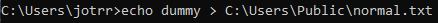
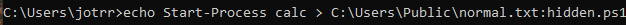
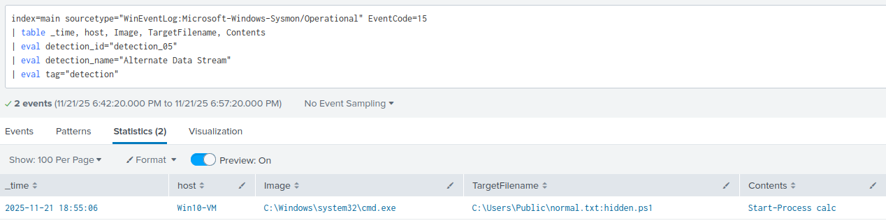
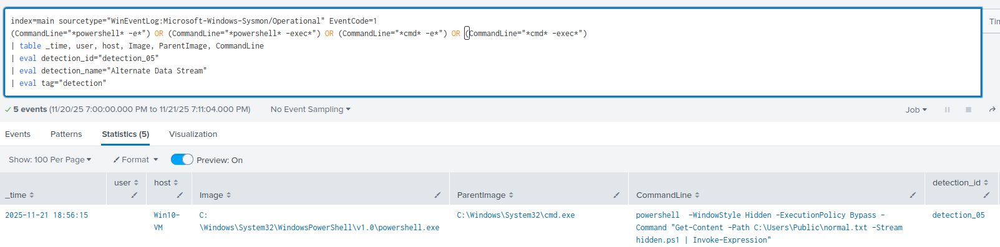

### Detection 05: Alternate Data Stream Execution

### Purpose 

Detect the abuse of NTFS Alternate Data Streams (ADS) to hide and/or execute malicious content

---

### ATT&CK Mapping

- T1564.004 - Hide Artifacts: NTFS File Attributes

---

### Data Sources

| Source | Details |
|--------|---------|
| Sysmon/Operational | Event ID 15 & Event ID 1 |

---

### Test Case

Create an alternate data strean tied to a normal text file which contains a harmless powershell command (calc.exe) then execute it. Verify it shows in Splunk

Expected Result: calc.exe opens in background session on execution, and Splunk detects the ADS creation + execution

1. Create a dummy file in cmd.exe
```cmd
echo dummy > C:\Users\Public\normal.txt
```


2. Add an alternate data stream to the file with the contents of "Start-Process calc"
```cmd
echo Start-Process calc > C:\Users\Public\normal.txt:hidden.ps1
```



3. Execute the file with powershell, still in cmd.
```cmd
powershell -WindowStyle Hidden -ExecutionPolicy Bypass - Command "Get-Content -Path C:\Users\Public\normal.txt -Stream hidden.ps1 | Invoke-Expression"
```

4. Run the SPL Queries to verify Splunk caught the ADS creation + execution





---

### SPL Detection Queries

**Production Rule (Stream Creation)**

```spl
index=main sourcetype="WinEventLog:Microsoft-Windows-Sysmon/Operational" EventCode=15
| table _time, host, Image, TargetFilename, Contents
| eval detection_id="detection_05"
| eval detection_name="Alternate Data Stream"
| eval tag="detection"
```

**Production Rule (Execution from ADS)**

```spl
index=main sourcetype="WinEventLog:Microsoft-Windows-Sysmon/Operational" EventCode=1
(CommandLine="*powershell* -e*") OR (CommandLine="*powershell* -exec*") OR (CommandLine="*cmd* -e*") OR (CommandLine="*cmd* -exec*")
| table _time, user, host, Image, ParentImage, CommandLine
| eval detection_id="detection_05"
| eval detection_name="Alternate Data Stream"
| eval tag="detection"
```

---

### Notes
- Alternate Data Streams are rare in legitmate environments, investigate thuroughly
- Our execution from an ADS rule only detects powershell execs, other exec paths can be added such as cmd.exe

---

### Flase Positives
- Testers or forensic analysts may set up alternate data streams as part of a legit workflow
- Some installers may write an ads in %ProgramData%.

### Tuning
- Work with testers/analysts to whitelist legitmate streams
- Whitelist trusted installers that write ads'
- Refine rule by analysing parent processes

---

### Quick Playbook

1. Pull the ParentImage to see where the stream creation happened
2. Use ProcessGuid to try link to a ProcessCreate event
3. Inspect the contents field to see if the payload is malicious, if so -> Isolate
4. Check for persistence in RunKeys, services, or scheduled tasks.

**Elevate when:**
- Contents contains a script or malicious binary
- If the ADS was created by a LOLBin unexpectedly
- The file path is in a user-writable location
- Lateral movement detected
- An admin/system user is unexpectedly running these commands.

---

### Status:
- ✅ Test case validated
- ✅ Test Evidence captured
- ✅ Production ready
