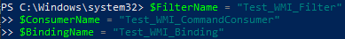
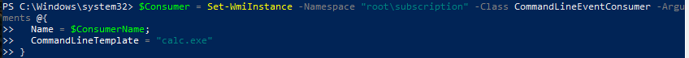
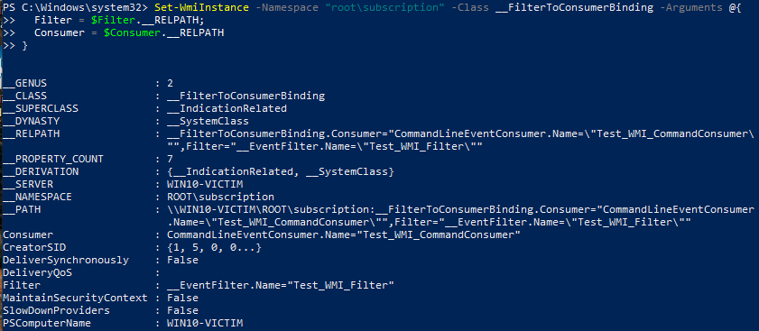
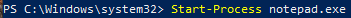
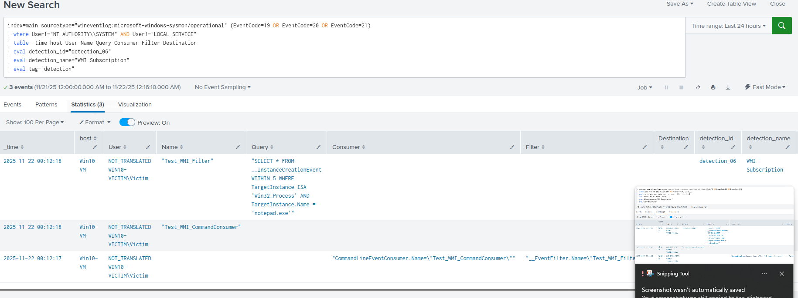
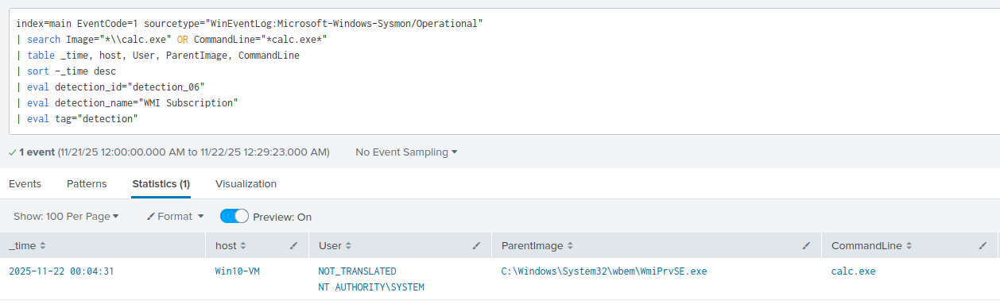
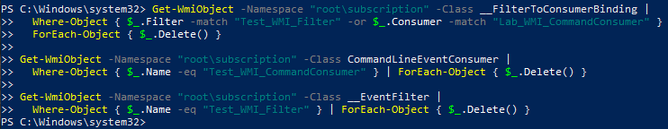

# Detection 06 - WMI Event Subscription Persistence

### Purpose

Detect the creation/modification of WMI event subcriptions (EventFilter, EventConsumer, FilterToConsumerBinding) for persistence.

Wmi persistence is often used by attackers because it runs automatically when triggered by a system event, and the resulting action can execute with SYSTEM level privileges.

### ATT&CK Mapping

- T1546.003 - Event Triggered Execution: Windows Management Instrumentation Event Subscription

### Data Sources

| Source | Details |
|--------|---------|
| Sysmon  | Event ID 19, 20, 21 |


### Test Case

Create a filter, command consumer, and binding that runs calc.exe when notepad.exe is created.

Expected Result: When notepad runs, calc will also run. WMI Event creation will correctly ingest into splunk

1. Create the WMI event variables
```powershell
$FilterName = "Test_WMI_Filter"
$ConsumerName = "Test_WMI_CommandConsumer"
$BindingName = "Test_WMI_Binding"
```



2. Create an Event Filter
```powershell
$Filter = Set-WmiInstance -Namespace "root\subscription" -Class __EventFilter -Arguments @{
  Name = $FilterName;
  EventNamespace = "root\cimv2";
  QueryLanguage = "WQL";
  Query = "SELECT * FROM __InstanceCreationEvent WITHIN 5 WHERE TargetInstance ISA 'Win32_Process' AND TargetInstance.Name = 'notepad.exe'"
}
```


3. Create a CommandLineEventConsumer
```powershell
$Consumer = Set-WmiInstance -Namespace "root\subscription" -Class CommandLineEventConsumer -Arguments @{
  Name = $ConsumerName;
  CommandLineTemplate = "calc.exe"
}
```



4. Bind them together
```powershell
Set-WmiInstance -Namespace "root\subscription" -Class __FilterToConsumerBinding -Arguments @{
  Filter = $Filter.__RELPATH;
  Consumer = $Consumer.__RELPATH
}
```



5. Open an instance of notepad.exe (calc.exe should run in the background, you'll have to verify in step 7)



6. Verify the creation events in Splunk using the production SPL query



7. Once confirmed, use the hunter companion to verify calc.exe runs. 



8. Remove the subscription to cleanup
```powershell
Get-WmiObject -Namespace "root\subscription" -Class __FilterToConsumerBinding |
  Where-Object { $_.Filter -match "Test_WMI_Filter" -or $_.Consumer -match "Lab_WMI_CommandConsumer" } |
  ForEach-Object { $_.Delete() }

Get-WmiObject -Namespace "root\subscription" -Class CommandLineEventConsumer |
  Where-Object { $_.Name -eq "Test_WMI_CommandConsumer" } | ForEach-Object { $_.Delete() }

Get-WmiObject -Namespace "root\subscription" -Class __EventFilter |
  Where-Object { $_.Name -eq "Test_WMI_Filter" } | ForEach-Object { $_.Delete() }
```



---

### SPL Detection Queries

**Production Rule**

```spl
index=main sourcetype="wineventlog:microsoft-windows-sysmon/operational" (EventCode=19 OR EventCode=20 OR EventCode=21)
| where User!="NT AUTHORITY\\SYSTEM" AND User!="LOCAL SERVICE"
| table _time host User Name Query Consumer Filter Destination
| eval detection_id="detection_06"
| eval detection_name="WMI Subscription"
| eval tag="detection"
```

**Hunting Companion** 

Upon WMI event creation detection, replace the search image in this query with whatever shows in the CommandLine field

```spl
index=main EventCode=1 sourcetype="WinEventLog:Microsoft-Windows-Sysmon/Operational"
| search Image="*\\calc.exe" OR CommandLine="*calc.exe*"
| table _time, host, User, ParentImage, CommandLine
| sort -_time desc
| eval detection_id="detection_06"
| eval detection_name="WMI Subscription"
| eval tag="detection"
```

---

### Notes

- The production rule ignores events created by System accounts to reduce noise
- WMI subscriptions can persist across reboots, so check root\subscription namespace
- WMI events may differ in formatting between windows versions

---

### False Positives

- Automation using WMI subscriptions
- Endpoint management tools
- MSI installers or vendor agents

### Tuning 

- Whitelist known vendors by their tool name if they utilise WMI
- Add a suspicious indicitator e.g Event log strings that looks for powershell or cmd.exe

---

### Quick Playbook

On detection:

1. Pull the Query, Consumer, Filter, and Destination fields
2. Inspect the Query field for a binary/script path 
3. If malicious -> Isolate host
4. Check for Process creation (Use the hunting companion) and lateral movement
5. If benign -> Add to whitelist

Elevate when:
- Query is malicious
- The subscription unexpectedly calls a LOLBin
- Lateral movement detected

---

Status:
- ✅ Test case validated
- ✅ Test Evidence captured
- ✅ Production ready
