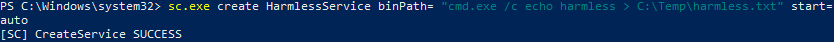
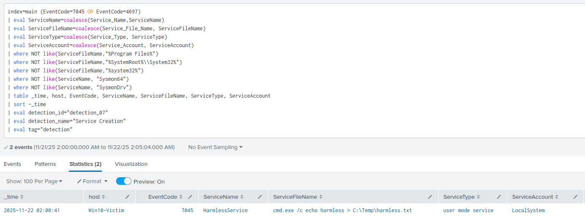
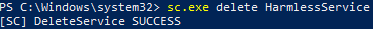

# Detection 07 - Service Creation

### Purpose

Detect the creation of Windows Services.

Attackers use Windows Services to maintain persistence becuase service accounts often use static credentials that rarely change, and run with high level privileges

---

### ATT&CK Mapping

T1543.003 - Create or Modify System Process: Windows Service

---

### Data Sources

| Source | Details |
|--------|---------|
| WinEventLog | EventCode=7045 OR EventCode=4697 |

---

### Test Case

Create a harmless service, then verify the service creation in splunk

Expected outcome: A service that echo's some text is created. 

1. Create a service that echo's some text
```powershell
sc.exe create HarmlessService binPath= "cmd.exe /c echo harmless > C:\Temp\harmless.txt" start= auto
```



2. Check the service was created
```powershell
sc.exe query HarmlessService
```


3. Verify the event was ingested into Splunk using the production spl query



4. Cleanup the service by deleting it
```powershell
sc.exe delete HarmlessService
```



---

### SPL Detection Queries

**Production Rule**

```spl
index=main (EventCode=7045 OR EventCode=4697)
| eval ServiceName=coalesce(Service_Name,ServiceName)
| eval ServiceFileName=coalesce(Service_File_Name, ServiceFileName)
| eval ServiceType=coalesce(Service_Type, ServiceType)
| eval ServiceAccount=coalesce(Service_Account, ServiceAccount)
| where NOT like(ServiceFileName,"%Program Files%")
| where NOT like(ServiceFileName,"%SystemRoot%\\System32%")
| where NOT like(ServiceFileName,"%system32%")
| where NOT like(ServiceName, "Sysmon64")
| where NOT like(ServiceName, "SysmonDrv")
| table _time, host, EventCode, ServiceName, ServiceFileName, ServiceType, ServiceAccount
| sort -_time
```

---

### Notes
- Service creations are very common, typically by System accounts and legitimate software
- To reduce most of the noise, the production rule ignores services created from %Program Files%, System folders, and Sysmon

---

### False Positives
- Legitimate software and installers
- Admin tools

### Tuning 
- Whitelist services created by admins
- Whitelist trusted services and software

---

### Quick Playbook

1. Verify the service name and binary path
2. Query Sysmon EventCode 1 (ProcessCreate) around the same time as service creation to determine the origin
3. Check for a suspicious path
4. If service is malicious -> Isolate and check for persistence
5. If service is benign -> Whitelist

Elevate When:
- Path is suspicious e.g Temp, Public, AppData
- Origin is suspicious e.g Unknown installer

---

### Status:
- ✅ Test case validated
- ✅ Test Evidence captured
- ✅ Production ready
