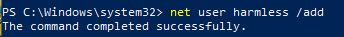
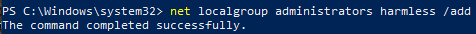
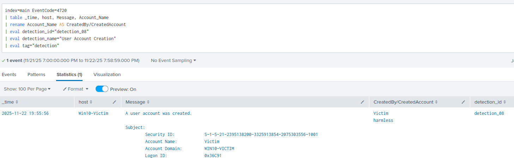
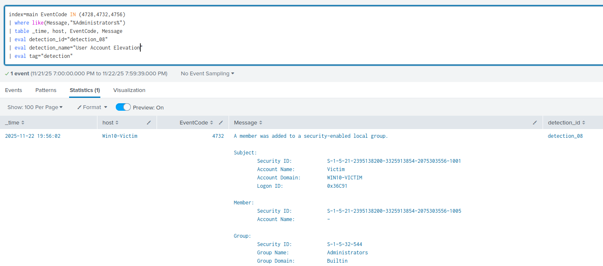
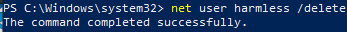

# Detection 08 - User Account Creation

### Purpose

Detect the creation of local user accounts or the addition of users to privileged groups.

Once attackers gain access to an admin account, they can create additional admin accounts to maintain persistence.

---

### ATT&CK Mapping

T1136.001 - Create Account: Local Account

T1098 - Account Manipulation

---

### Data Sources

| Source | Details |
|--------|---------|
| WinEventLog:Security | EventCode: 4720, 4728, 4732, 4756 |

---

### Test Case

Create a local account, add it to the administrators group, then remove the account.

Expected result: Production rule catches account creation, and the hunting companion catches the addition to the administrators group.


1. Create a harmless local account:

```powershell
net user harmless /add
```



2. Then add it to Administrators:
```powershell
net localgroup administrators harmless /add
```



3. Use the Production query to check account creation was detected



4. Use the hunter companion to check privilege escalation was detected



5. Remove the account (Cleanup):
```powershell
net user harmless /delete
```



---

### SPL Detection Queries

**Production Rule**

```spl
index=main EventCode IN (4728,4732,4756)
| where like(Message,"%Administrators%")
| table _time, host, EventCode, Message
| eval detection_id="detection_08"
| eval detection_name="User Account Creation"
| eval tag="detection"
```

**Hunter Companion (Detect Privilege escalation)**

```spl
index=main EventCode IN (4728,4732,4756)
| where like(Message,"%Administrators%")
| table _time, host, EventCode, Message
| eval detection_id="detection_08"
| eval detection_name="User Account Elevation"
| eval tag="detection"
```

---

### Notes
- This detection uses Wndows:Security instead of sysmon, so the relevant information isn't as neatly parsed

### False Positives
- Standard Admin activity
- Installers that create service accounts

### Tuning 
- Add trusted installers and software to a whitelist
- Consider filtering trusted admin activity by time/location i.e If outside work hours -> flag suspicious

### Quick Playbook
1. Identify the account creator
2. Check if the created account was granted admin privileges (Use hunting companion)
3. Cross reference with sysmon process creation logs to find source process
4. If suspicious -> disable account

**Elevate when:**
- Creator isn't a legitimate admin account
- Source process is malicious

### Status:
- ✅ Test case validated
- ✅ Test Evidence captured
- ✅ Production ready


