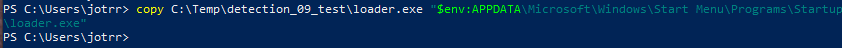
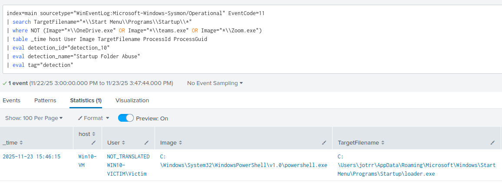

# Detection 10 - Startup Folder Abuse

### Purpose

Detect the use creation of a startup file for the use of persistence.

Attackers can maintain presence on a system by placing an executable, shortcut, or script inside the user or system's Startup folder.
Any file in this directory is executed upon login

---

### ATT&CK Mapping

T1574.001 - Boot or Logon Autostart Execution: Startup Folder

---

### Data Sources

| Source | Details |
|--------|---------|
| Sysmon | EventCode - 11 |

---

### Test Case

Move the loader.exe file created in detection_09 (Or pull the created file from "test_files") into the startup directory

Expected Result: loader.exe should run on startup and Splunk should detect the creation of the file in the startup folder.

1. Pull the loader.exe file if needed

2. Move the executable into the startup folder

```powershell
copy <YourPathtoloader.exe> "$env:APPDATA\Microsoft\Windows\Start Menu\Programs\Startup\loader.exe"
```



3. Use the spl detection query to verify the file move was logged



---

### SPL Detection Queries

**Production Rule**

```spl
index=main sourcetype="WinEventLog:Microsoft-Windows-Sysmon/Operational" EventCode=11
| search TargetFilename="*\\Start Menu\\Programs\\Startup\\*"
| where NOT (Image="*\\OneDrive.exe" OR Image="*\\teams.exe" OR Image="*\\Zoom.exe")
| table _time host User Image TargetFilename ProcessId ProcessGuid
```

---

### Notes
- Some applications will write to the startup folder, the production rule excludes a few by default

---

### False Positives
- Legitimate installers
- Software management agents

### Tuning 
- Whitelist trusted vendors by Image

---

### Quick Playbook
1. Identify the file creator and time of creation
2. Pull the TargetFileName and Image fields
3. If the file is malicious or runs from a suspicious lolbin -> Isolate
4. Delete the malicious executables and check for similar entries in ProgramData\Startup (The system startup folder)
5. Reset startup permissions to default and check for related persistence

**Elevate when:**
- The file is malicious
- The parent process that created the file is untrusted or suspicious

---

### Status:
- ✅ Test case validated
- ✅ Test Evidence captured
- ✅ Production ready

